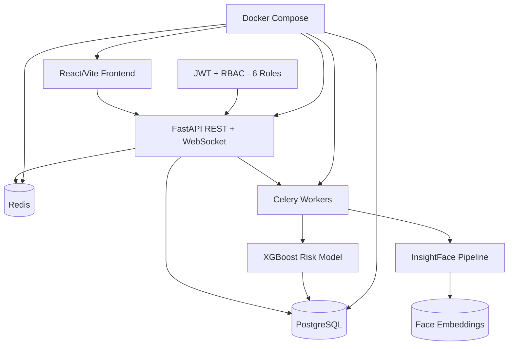

# AI-Classroom-Intelligent-System (VISTA) — Graphify Knowledge Graph

**Generated:** 2026-07-18
**AIOS Graphify Version:** 1.0.0

---

## Project Structure

### Root
```
AI-Classroom-Intelligent-System/
  vista/
    backend/         — FastAPI + SQLAlchemy backend
    frontend/        — React 18 + Vite + Tailwind CSS frontend
    ml/              — XGBoost model training
    vision/          — InsightFace face recognition
    docker/          — Docker configuration
```

### Backend Architecture
```
vista/backend/
  app/
    main.py          — FastAPI entry point
    models/          — SQLAlchemy models (24 tables)
    routes/          — API routes (85+ endpoints)
    services/        — Business logic (attendance, alerts, reporting)
    middleware/      — Auth middleware (JWT, RBAC, 6 roles)
  alembic/           — Database migrations
```

### ML Architecture
```
vista/ml/
  train.py           — XGBoost training (F1=0.957)
  predict.py         — Risk prediction inference
  features.py        — Feature engineering
  models/            — Saved model artifacts
```

### Vision Architecture
```
vista/vision/
  detect.py          — Face detection (SCRFD)
  recognize.py       — Face recognition (ArcFace R50)
  embed.py           — Face embedding generation
  match.py           — Face matching pipeline
```

## Technology Nodes

| Node | Type | Version |
|---|---|---|
| Python | language | 3.11 |
| FastAPI | framework | 0.x |
| SQLAlchemy | orm | 2.x |
| React | framework | 18.x |
| Vite | build-tool | 5.x |
| Tailwind CSS | framework | 3.x |
| InsightFace | cv-library | — |
| SCRFD | model | face-detection |
| ArcFace R50 | model | face-recognition |
| XGBoost | ml-library | 2.x |
| SHAP | ml-library | — |
| PostgreSQL | database | 16.x |
| Redis | cache | 7.x |
| Celery | task-queue | — |
| Docker | container | — |
| WebSocket | protocol | — |

## Dependency Graph



## Module Boundaries

| Module | Description | Depends On |
|---|---|---|
| backend | FastAPI server | database, redis |
| frontend | React SPA | api, websocket |
| vision | Face recognition | backend |
| ml | Risk prediction | backend, database |
| auth | JWT + 6-role RBAC | database |
| celery | Async task queue | redis, vision, ml |

## Entry Points

| Name | Path | Type |
|---|---|---|
| Backend Entry | vista/backend/app/main.py | server |
| Frontend Entry | vista/frontend/src/main.tsx | app |
| ML Training | vista/ml/train.py | script |
| Docker Compose | vista/docker-compose.yml | infra |

## AIOS Integration Points

- **Context Load:** `vista/backend/`, `vista/frontend/`, `vista/ml/`, `vista/vision/`
- **Graphify Path:** `graphify-out/`
- **Memory Path:** `AIOS/memory/projects/AI-Classroom/`
- **Documentation:** `vista/CLAUDE.md`
